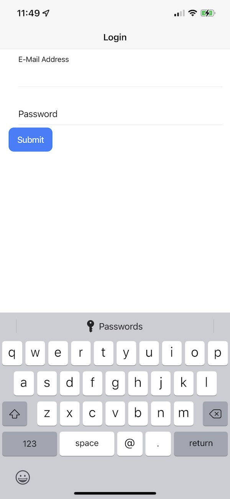

# Username / Password Sample
This is a sample application that shows a username/password form (use any input during testing) that works with password managers.

The challenge with password managers is that they need certain **cues** to allow them to signaled when a submission of a username and password happens. This sample provides those cues that allow a password manager (such as Chrome, Edge, Safari or Mobile Safari's password manager or 3rd party tools like Last Pass) to work.

## Working with Web

The key **cue** for a password manager is the `submit` action of a html `form`. Lets start with the required `form`:
```html
    <form (ngSubmit)="onSubmit()">
      <ion-button type="submit">Submit</ion-button>
    </form>
```
The `form` has Angular's equivalent of `onSubmit` and we also have a button of type `submit`.

For our username and password fields:
```html
<ion-input type="email" name="email" autocomplete="email" [(ngModel)]="email" required email></ion-input>
<ion-input type="password" name="password"  autocomplete="current-password" [(ngModel)]="password" required></ion-input>
````

The `ion-input` has a `name` property that provides a cue for the password manager to treat them as a username or password.

When used in combination your password manager will detect submission of a username and password and captures the saving of credentials and associated domain. When viewing the login form it will also handle autofilling of the username and password.


## Working in a Web Native App

When the same application is run a web view you will get different behavior with password managers depending on the platform.

Android's web view will auto-complete passwords and allow autofill of credentials. This is done with Capacitor by associating credentials with the hostname of the app which by default is `localhost`. As a caveat this means that any other Capacitor based app will also suggest credentials for the app.

In iOS the `username` field will have an option to launch the Password Manager as shown below:
[]

Although your app has the correct setup for autofilling of credential there is an issue with the native web view that prevents correct functionality. This is documented in this bug: [https://bugs.webkit.org/show_bug.cgi?id=203299](https://bugs.webkit.org/show_bug.cgi?id=203299).

